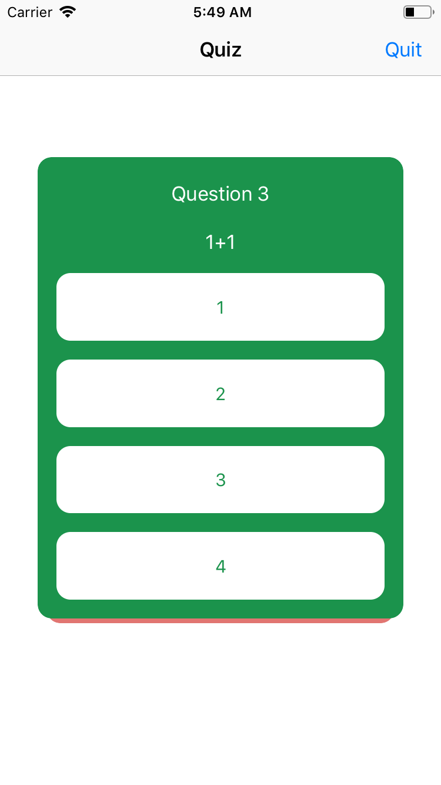
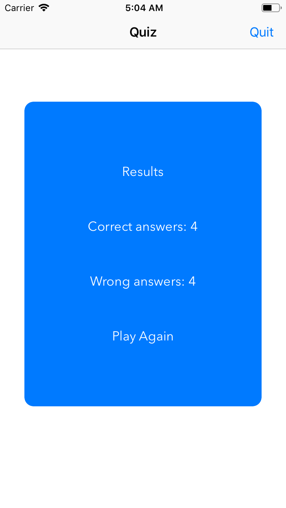
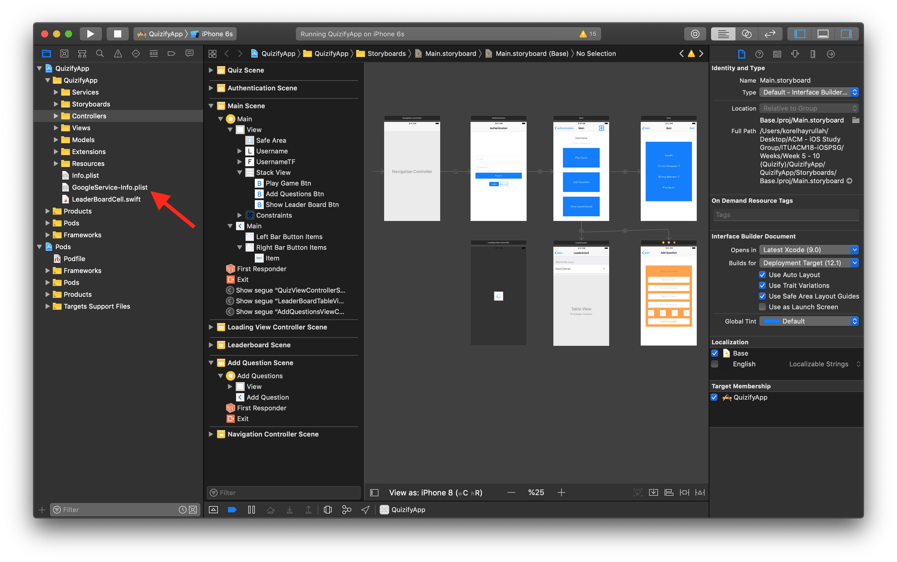

# Quizify App

This project aims to give an opinion to students to demonstrate how a simple app can be done using Firebase (authentication & database) and pods.

### Screenshots

### Important!!!

In order to make the project work, first you have to create a [new](https://console.firebase.google.com/) firebase project for iOS and drag the GoogleService-Info.plist file like shown in the figure below with the red arrow.

###### Pods used in this project

* [Koloda](https://github.com/Yalantis/Koloda)
* [IQKeyboardManagerSwift](https://github.com/hackiftekhar/IQKeyboardManager)
* Firebase/Core
* Firebase/Auth
* Firebase/Firestore

###### Topics to read

* [Firebase](https://firebase.google.com/)

* [Firebase Authentication](https://firebase.google.com/docs/auth/)
* [Firebase Cloud Firestore](https://firebase.google.com/docs/firestore/)

###### Links

* [Cocoapods](https://cocoapods.org/)

 